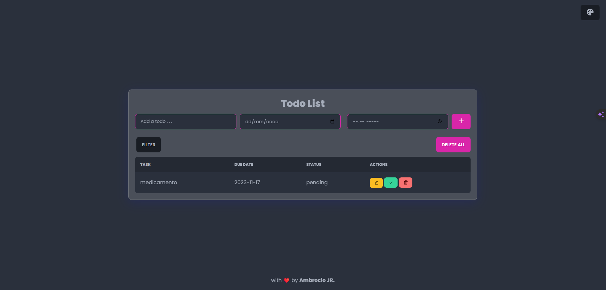

# Lista de Tareas Web con CSS y JavaScript

¡Bienvenido al repositorio de la aplicación web de Lista de Tareas! Este proyecto ofrece una solución simple y elegante para gestionar tus tareas de manera eficiente. Construido con CSS y JavaScript, esta aplicación te permite crear, organizar y guardar tareas fácilmente, todo dentro de una interfaz de usuario visualmente atractiva.

## Características

- **Agregar Nuevas Tareas:** Añade nuevas tareas fácilmente con una interfaz amigable.
- **Marcar como Completado:** Realiza un seguimiento de las tareas completadas marcándolas como terminadas.
- **Eliminar o Editar:** Elimina tareas completadas o modifica aquellas que ya no son necesarias.
- **Almacenamiento Persistente:** Guarda las tareas en el almacenamiento local para una persistencia de datos sin inconvenientes.
- **Programar Tareas:** Organiza tus tareas asignándoles horarios para una mejor gestión del tiempo.
- **Cambiar Estado de las Tareas:** Actualiza el estado de tus tareas con un simple clic.
- **Filtrar por Estado:** Simplifica tu vista filtrando tareas según su estado.

## Capturas de Pantalla

![Lista de Tareas App] 

## Tecnologías Utilizadas

- **HTML5:** Define la estructura de la aplicación web.
- **CSS3:** Proporciona estilos visualmente atractivos para mejorar la experiencia del usuario.
- **JavaScript:** Impulsa la funcionalidad interactiva de la aplicación.
- **Almacenamiento Local:** Garantiza el almacenamiento persistente de datos en diferentes sesiones del navegador.

## Inicio Rápido

Para ejecutar la aplicación web de Lista de Tareas en tu máquina local, sigue estos pasos:

1. **Clona el repositorio:**

    ```bash
    git clone 
    ```

2. **Abre el archivo `index.html` en tu navegador web preferido.**

¡Listo! Estás preparado para comenzar a gestionar tus tareas con la aplicación web de Lista de Tareas. Si encuentras algún problema o tienes sugerencias, no dudes en contribuir o abrir un problema. ¡Feliz gestión de tareas!